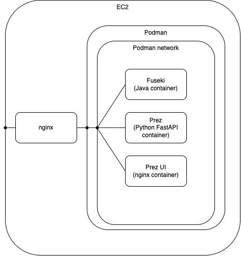

# QLD Gov Dept Resources Ansible Prez Stack

An Ansible playbook and roles to manage cloud VMs running the Prez Stack.

The Prez Stack consists of the following:

- Apache Jena Fuseki (database)
- Prez (backend web API)
- Prez UI (web server serving static web assets for the Prez UI)
- Nginx (web server - ingress proxy to the stack)

The different components of the Prez Stack run inside containers managed by Podman. The containers themselves are not managed directly with Podman but rather are managed through systemctl. Example, to restart the Fuseki container, run `sudo systemctl restart container-fuseki`. However, manual actions such as these shouldn't be required and instead, they should be actioned through a role within the `prez.yml` playbook.

Fuseki, Prez and Prez UI all run inside their own containers and they are accessed through an NGINX server running on the target machine.



## Before starting

This playbook assumes a cloud VM with SSH access has been set up. If you are using AWS, it would be an EC2 instance.

Ensure a DNS record has been set to point to the IP of the VM and update the domain name information in the `hosts` file and the `group_vars/webservers.yml`. This value is used to target the VM machine and also to register an SSL certificate with Let's Encrypt.

## Ansible environment

Ansible version 2.14 and Python 3.9 - 3.11 is required.

### Create a Python virtual environment and use it.

```
python -m venv venv
source venv/bin/activate
```

### Install the Python dependencies.

```
pip install -r requirements.txt
```

The Ansible `hosts` file with a section named `webservers` manages the target machines these plays apply to.

## Ansible playbooks

### Viewing/editing Ansible Vault file

The file `vault.yml` is encrypted using Ansible Vault. To view or edit the file, run the following.

Note: obtain the password from the system system administrator and create a file `./ansiblepass` before proceeding.

To edit the vault file, run the following.

```
ansible-vault edit group_vars/vault.yml --vault-password-file ./ansiblepass
```

### Running Ansible Roles

Run the roles in sequence for a fresh installation. The plays target the hosts with the `remote_server_user` defined in [group_vars/vault.yml](group_vars/vault.yml).

---

#### Install nginx, certbot and setup letsencrypt.

Note: modify the letsencrypt variables in [group_vars/webservers.yml](group_vars/webservers.yml) as required.

```
ansible-playbook -i hosts --vault-password-file ./ansiblepass prez.yml -t nginx.install
```

#### Install podman.

```
ansible-playbook -i hosts --vault-password-file ./ansiblepass prez.yml -t podman.install
```

#### Install Qld Gov Dept Resource Prez UI.

Note: modify the container image variable in [group_vars/webservers.yml](group_vars/webservers.yml) as required.

```
ansible-playbook -i hosts --vault-password-file ./ansiblepass prez.yml -t prez-ui.install
```

#### Install Apache Jena Fuseki.

Note: modify the Fuseki variables in [group_vars/webservers.yml](group_vars/webservers.yml) as required.

Fuseki's exposure to the public internet via nginx is controlled by the `nginx_expose_fuseki` variable. When the `nginx_expose_fuseki` value is changed, run the `nginx.install` role to apply to the target hosts.

Fuseki's basic authentication details such as username and password can be changed by editing [group_vars/vault.yml](group_vars/vault.yml)

```
ansible-playbook -i hosts --vault-password-file ./ansiblepass prez.yml -t fuseki.install
```

#### Load initial data into Fuseki.

```
ansible-playbook -i hosts --vault-password-file ./ansiblepass prez.yml -t fuseki.load-initial-data
```

#### Install Prez.

Note: modify the Prez variables in [group_vars/webservers.yml](group_vars/webservers.yml) as required.

```
ansible-playbook -i hosts --vault-password-file ./ansiblepass prez.yml -t prez.install
```

#### Enable swap on target machine.

Note: modify the swapfile variables in [group_vars/webservers.yml](group_vars/webservers.yml) as required.

```
ansible-playbook -i hosts --vault-password-file ./ansiblepass prez.yml -t swapfile.enable
```
